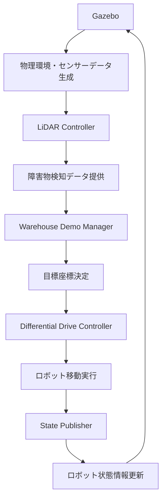

# ROS2ノードアーキテクチャ解説

## 概要

このドキュメントでは、搬送ロボット倉庫シミュレーションシステムで動作するROS2ノードの詳細な構成と役割について説明します。

## システム全体構成

このシステムは以下の要素で構成されています：
- **5台の搬送ロボット**（robot_1 ～ robot_5）
- **Gazeboシミュレーター**
- **デモ管理システム**

## 実行中のROS2ノード一覧

```
/gazebo
/robot_1/differential_drive_controller
/robot_1/gazebo_ros_lidar_controller
/robot_1/robot_1_state_publisher
/robot_2/differential_drive_controller
/robot_2/gazebo_ros_lidar_controller
/robot_2/robot_2_state_publisher
/robot_3/differential_drive_controller
/robot_3/gazebo_ros_lidar_controller
/robot_3/robot_3_state_publisher
/robot_4/differential_drive_controller
/robot_4/gazebo_ros_lidar_controller
/robot_4/robot_4_state_publisher
/robot_5/differential_drive_controller
/robot_5/gazebo_ros_lidar_controller
/robot_5/robot_5_state_publisher
/warehouse_demo_manager
```

## 各ノードの詳細説明

### 🎮 Gazeboシミュレーター

#### `/gazebo`
**役割**: 物理シミュレーション環境の提供

**機能**:
- 3D物理エンジンによるロボットの動作シミュレーション
- 倉庫環境（壁、障害物、棚）の描画・管理
- センサー（LiDAR）のデータ生成
- ロボット間の衝突検知
- 重力、摩擦、慣性などの物理法則の適用

**技術仕様**:
- 物理エンジン: ODE (Open Dynamics Engine)
- 更新頻度: 250Hz (real_time_update_rate)
- 時間ステップ: 0.004秒 (max_step_size)

### 🤖 各ロボットのノード群（robot_1 ～ robot_5）

#### 差動駆動コントローラー
```
/robot_X/differential_drive_controller
```

**役割**: ロボットの移動制御

**機能**:
- `/cmd_vel` トピックから速度指令（線形・角速度）を受信
- 左右の車輪速度を計算・制御
- オドメトリ情報（位置・姿勢・速度）を発行
- 4輪差動駆動システムの実装

**主要トピック**:
- **購読**: `/robot_X/cmd_vel` (geometry_msgs/Twist)
  - 線形速度: linear.x (m/s)
  - 角速度: angular.z (rad/s)
- **発行**: `/robot_X/odom` (nav_msgs/Odometry)
  - 位置: pose.pose.position
  - 姿勢: pose.pose.orientation
  - 速度: twist.twist

**パラメータ**:
- 車輪間距離: 0.6m
- 車輪直径: 0.2m
- 最大トルク: 20 Nm
- 最大加速度: 1.0 m/s²

#### LiDARセンサーコントローラー
```
/robot_X/gazebo_ros_lidar_controller
```

**役割**: LiDARセンサーのデータ処理

**機能**:
- 360度レーザースキャンデータの生成
- 障害物検知用の距離データ提供
- ノイズモデルの適用（ガウシアンノイズ）

**主要トピック**:
- **発行**: `/robot_X/scan` (sensor_msgs/LaserScan)

**技術仕様**:
- サンプル数: 360個
- 角度範囲: -π ～ π rad（360度）
- 測定範囲: 0.1m ～ 10.0m
- 更新頻度: 10Hz
- 角度分解能: π/180 rad（1度）
- ノイズ: 平均0.0、標準偏差0.01のガウシアンノイズ

#### ロボット状態発行者
```
/robot_X/robot_X_state_publisher
```

**役割**: ロボットの構造情報管理

**機能**:
- URDF（Unified Robot Description Format）の解析
- ロボットの関節・リンク情報の発行
- TF（座標変換）情報の管理
- 3D可視化用のロボット形状データ提供

**主要トピック**:
- **発行**: `/tf` (tf2_msgs/TFMessage) - 動的座標変換
- **発行**: `/tf_static` (tf2_msgs/TFMessage) - 静的座標変換
- **発行**: `/robot_X/robot_description` (std_msgs/String) - URDF情報

**座標フレーム**:
- `base_link`: ロボットの基準フレーム
- `lidar_link`: LiDARセンサーのフレーム
- `front_left_wheel`, `front_right_wheel`: 前輪フレーム
- `rear_left_wheel`, `rear_right_wheel`: 後輪フレーム

### 🏭 倉庫デモ管理システム

#### `/warehouse_demo_manager`
**役割**: 全体的なデモ制御・管理

**機能**:
- 5台のロボットの協調制御
- ウェイポイント（目標地点）の管理
- ロボット間の衝突回避調整
- デモシナリオの実行制御
- 移動完了の監視

**制御ロジック**:
1. 各ロボットの現在位置を監視
2. 次の目標座標を決定
3. `/robot_X/cmd_vel` に速度指令を送信
4. 目標到達を確認
5. 次のウェイポイントに移行

**デフォルトウェイポイント**:
- robot_1: (-8.0, -8.0) → (-6.0, -6.0) → (6.0, -6.0) → ...
- robot_2: (8.0, -8.0) → (6.0, -6.0) → (6.0, 6.0) → ...
- robot_3: (8.0, 8.0) → (6.0, 6.0) → (-6.0, 6.0) → ...
- robot_4: (-8.0, 8.0) → (-6.0, 6.0) → (-6.0, -6.0) → ...
- robot_5: (0.0, 0.0) → (8.0, 0.0) → (0.0, 8.0) → ...

## システムの動作フロー



## ノード間通信の詳細

### 主要なトピック通信

| トピック名 | メッセージ型 | 発行者 | 購読者 | 説明 |
|-----------|-------------|--------|--------|------|
| `/robot_X/cmd_vel` | geometry_msgs/Twist | warehouse_demo_manager | differential_drive_controller | 速度指令 |
| `/robot_X/odom` | nav_msgs/Odometry | differential_drive_controller | warehouse_demo_manager | オドメトリ情報 |
| `/robot_X/scan` | sensor_msgs/LaserScan | gazebo_ros_lidar_controller | (障害物回避システム) | LiDARデータ |
| `/tf` | tf2_msgs/TFMessage | robot_state_publisher | 全ノード | 座標変換情報 |

### サービス通信

各ノードは必要に応じてサービス通信も提供：
- パラメータ設定サービス
- 状態問い合わせサービス
- 緊急停止サービス

## ノードの詳細確認方法

### 基本的な確認コマンド

```bash
# コンテナに入る
docker-compose exec ros2-transport-robots bash

# 環境設定
source /opt/ros/humble/setup.bash
source /workspace/install/setup.bash

# ノード一覧表示
ros2 node list

# 特定ノードの詳細情報
ros2 node info /robot_1/differential_drive_controller

# トピック一覧表示
ros2 topic list

# 特定トピックの情報
ros2 topic info /robot_1/cmd_vel

# トピックデータの確認
ros2 topic echo /robot_1/odom
```

### 高度な確認方法

```bash
# ノード間の通信グラフ表示（GUI環境が必要）
ros2 run rqt_graph rqt_graph

# システム全体の監視
ros2 run rqt_console rqt_console

# パフォーマンス監視
ros2 run rqt_plot rqt_plot
```

## トラブルシューティング

### よくある問題と解決方法

#### 1. ノードが表示されない
```bash
# ROS2環境の再設定
source /opt/ros/humble/setup.bash
source /workspace/install/setup.bash

# ノードの再起動
ros2 launch transport_robots warehouse_simulation.launch.py
```

#### 2. トピック通信が機能しない
```bash
# トピックの存在確認
ros2 topic list | grep robot_1

# メッセージの流れを確認
ros2 topic hz /robot_1/cmd_vel
```

#### 3. Gazeboが応答しない
```bash
# Gazeboプロセスの確認
ps aux | grep gazebo

# 必要に応じて再起動
pkill gazebo
ros2 launch transport_robots warehouse_simulation.launch.py
```

## システムの特徴

### 分散アーキテクチャ
- **分散制御**: 各ロボットが独立したノード群を持つ
- **モジュラー設計**: 各機能が独立したノードとして実装
- **スケーラビリティ**: ロボット数の増減が容易

### リアルタイム性能
- **高頻度更新**: センサーデータ10Hz、物理シミュレーション250Hz
- **低遅延通信**: ROS2のDDS通信による効率的なデータ交換
- **並列処理**: 複数ノードの同時実行

### 安全性・信頼性
- **センサー統合**: LiDARによる障害物検知
- **協調動作**: 中央管理システムによる全体制御
- **フェイルセーフ**: ノード単位での障害分離

## 拡張可能性

このアーキテクチャは以下の拡張に対応可能：

- **ロボット数の増加**: 新しいロボットノード群の追加
- **センサーの追加**: カメラ、IMU等の新しいセンサーノード
- **AI機能の統合**: 経路計画、機械学習ノードの追加
- **外部システム連携**: データベース、Web API連携ノード

## 参考資料

- [ROS2公式ドキュメント](https://docs.ros.org/en/humble/)
- [Gazebo公式ドキュメント](http://gazebosim.org/documentation)
- [tf2ライブラリ](https://docs.ros.org/en/humble/p/tf2/)
- [sensor_msgsパッケージ](https://docs.ros.org/en/humble/p/sensor_msgs/)

---

**最終更新**: 2025年9月6日  
**対象ROS2バージョン**: Humble Hawksbill  
**対象Gazeboバージョン**: Gazebo 11
